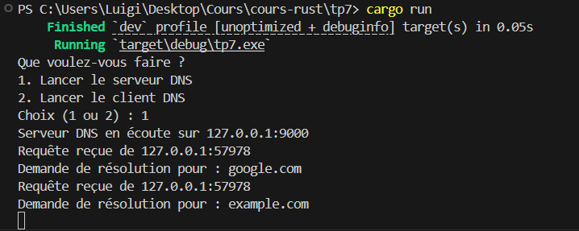
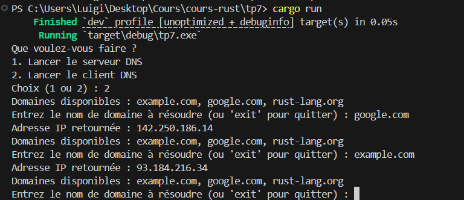
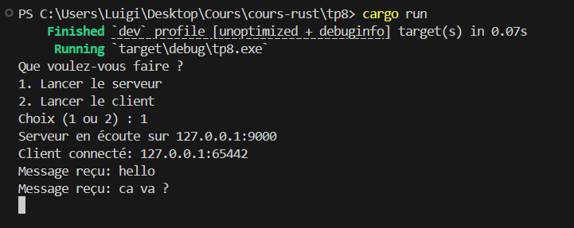
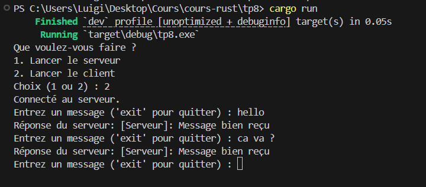
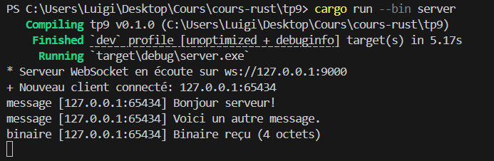
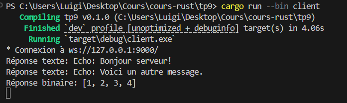

# Rust – Notes de cours 
*Luigi AUBRY-POUGET M1 AL*

## Général
- Langage système performant et sécurisé
- `.rs` : extension des fichiers source
- Possible de faire du web avec des frameworks

## Cargo (outil de gestion)
- `cargo new nom_projet` : crée un nouveau projet
- `cargo build` : compile (mode debug par défaut)
- `cargo run` : compile et exécute
- `cargo check` : vérifie sans compiler en binaire
- `cargo update` : met à jour les dépendances
- `cargo doc --open` : génère la doc et l’ouvre
- `Cargo.toml` : fichier config (comme `package.json`)

## Variables et types
- `let x = 5;` : déclaration
- `let x: i32 = 5;` : avec type explicite
- Types : `i32`, `u32`, `f32`, etc.
- `_x` : ignore une variable (évite warning)

## Fonctions
- `fn nom(param: Type) -> Type {}` : déclaration
- `return` optionnel

## Entrée utilisateur
```rust
let mut input = String::new();
std::io::stdin().read_line(&mut input).expect("Erreur");
```

## Tableaux
- `let tab: [i32; 4] = [1, 2, 3, 4];`
- `for x in tab` : itération simple
- `for (i, x) in tab.iter().enumerate()` : avec index

## Boucles
- `for i in 1..5` : de 1 à 4
- `for i in 1..=5` : de 1 à 5 inclus
- `loop {}` : boucle infinie
- `break` pour sortir

## Struct
```rust
struct Compte {
    nom: String,
    solde: f32,
}
```
- `compte.nom` : accès aux champs

## impl (méthodes)
```rust
impl Compte {
    fn afficher(&self) {
        println!("{}", self.nom);
    }
}
```

## Match (switch)
```rust
match x {
    1 => ...,
    _ => ..., // défaut
}
```

## Références
- `&mut` : référence mutable

# Lecture / écriture de fichiers & validation

## Écriture dans un fichier
- `File::create(path)` : crée ou écrase un fichier
- `file.write_all(&bytes)` : écrit des bytes dans le fichier
- erreurs gérées avec `Result`
- exemple :
  ```rust
  use std::fs::File;
  use std::io::Write;

  let mut file = File::create("fichier.txt").expect("Impossible de créer le fichier");
  file.write_all(b"Bonjour Rust !").expect("Erreur d'écriture");
  ```

## Validation avec `Result`
- opérations IO retournent `Result<T, E>`
- `Ok(valeur)` succès, `Err(erreur)` échec
- gérer avec `.expect()`

## Lecture dans un fichier
- `File::open(path)` : ouvre fichier en lecture
- `BufReader::new(file)` : tamponne la lecture
- `reader.read_to_string(&mut contenu)` : lit tout dans une `String`
- exemple :
  ```rust
  use std::fs::File;
  use std::io::{BufReader, Read};

  let file = File::open("fichier.txt").expect("Impossible d'ouvrir le fichier");
  let mut reader = BufReader::new(file);
  let mut contenu = String::new();
  reader.read_to_string(&mut contenu).expect("Erreur de lecture");
  println!("Contenu : {}", contenu);
  ```

## Ownership (propriété)
- Chaque valeur a un **propriétaire** unique.
- Lorsqu'une valeur est affectée à une autre variable, elle est **déplacée** (move), pas copiée, sauf pour les types `Copy`.
- Le propriétaire libère la mémoire à la fin de sa portée.
- Empêche les erreurs comme les accès concurrents ou les accès mémoire invalides.
- Utilisation de `&` pour un emprunt (borrow), `&mut` pour un emprunt mutable.

## Thread (fil d'exécution)
- Création avec `std::thread::spawn` :
```rust
let handle = std::thread::spawn(|| {
    // code à exécuter dans un thread
});
```
- Attente de la fin du thread avec `.join()` :
```rust
handle.join().unwrap();
```

## Canaux mpsc (multi-producer, single-consumer)
- Permet la communication entre threads via des canaux :
```rust
use std::sync::mpsc;
let (tx, rx) = mpsc::channel();
```
- `tx.send(val)` pour envoyer un message, `rx.recv()` pour le recevoir.

## Mutex
- Exclu mutuellement l’accès concurrent à une donnée partagée :
```rust
use std::sync::{Arc, Mutex};

let data = Arc::new(Mutex::new(0));
let data_cloned = Arc::clone(&data);

let handle = std::thread::spawn(move || {
    let mut val = data_cloned.lock().unwrap();
    *val += 1;
});
```

## Sockets UDP
- Utilisation de `std::net::UdpSocket` :
```rust
let socket = UdpSocket::bind("127.0.0.1:34254").expect("couldn't bind to address");
socket.send_to(b"hello", "127.0.0.1:8080").expect("send failed");
```

## Tokio (runtime asynchrone)
- Utilisé pour l’exécution de tâches `async` non bloquantes.
- Exemple basique :
```rust
#[tokio::main]
async fn main() {
    println!("Hello from Tokio!");
}
```
- Nécessite l’ajout de `tokio` dans le `Cargo.toml` :
```toml
[dependencies]
tokio = { version = "1", features = ["full"] }
```

## TP7 Fonctionnel

```cargo run```





## TP8 Fonctionnel

```cargo run```





## TP9 Fonctionnel

```cargo run --bin server```

```cargo run --bin client```



